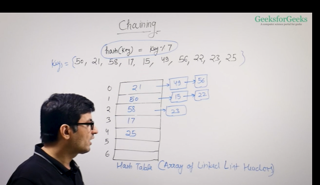

We maintain an array of linked list

for example 
hash function used is hash(key)=key%7
key={50,21,58,17,15,49,56,22,23,25}
Hash table-array of linked list headers
We use linked list as when a collision happens we insert the 
element at the linked list at the specific header 
[to view the image ctrl+shift+v]

performance 
m=no of slots in hash table 
n= no. of keys to be inserted 
load factor=n/m
expected chain length
When you create a hash map or hash set in cpp or java or an unordered set or an unordered set
then they allow you to set a load factor
It is a trade off between space and time 
Size of hash table 
load factor should be small otherwise there be many collisions 
load factor should be small 
Expected chain length -load factor 
assumption that all the keys are uniformly distributed -load factor 
Expected time to search -O(1+alpha)

Data structures to store chains -linked list,

linked list
Search O(l),Delete O(l),Insert O(l)
not Cache friendly 

Dynamic Sized array
Search O(l),Delete O(l),Insert O(l)
Cache friendly continuos locations 

Self balancing BST(AVL,REd blacktree)
Time->O(log l)-search,insert,delete -GOOD OPTION
not cache friendly 

LINKED LIST
TIME->Search O(l),Delete O(l),Insert O(l)
Not cache friendly 
uses extra space to store next pointers , next reference 
