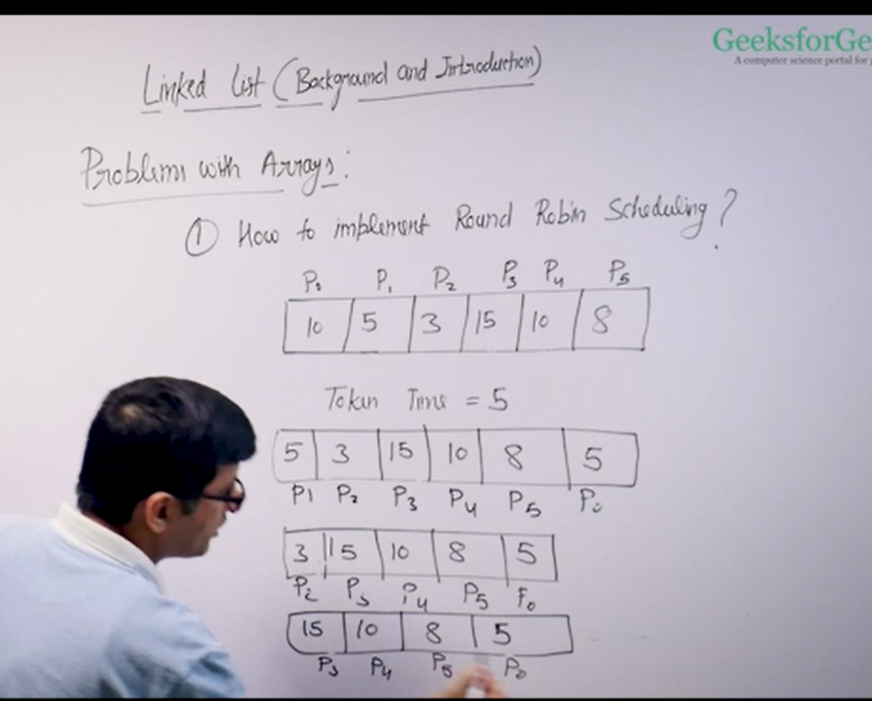

Problems with array data structure:
Array is sequential data structure such that data for which elements 
need to be contiguous memory location 
Linked list is also a sequential data structure 
but no need to be in contiguous memory location 
Array type:
int arr[100];
int arr[n];
int *arr=new int [n];
vector<int>v;->contiguous locations 
---------------------------------------------------
- Pre allocation of space and it is also fixed 
-Vector in cpp they double the size when they reach their 
full length and then copy the previous elements to the new 

problem- Operation which has big O(n ) then they become costly to do so
-Insertion in the middle is costly 
-Deletion is also costly
- It is difficult to implement data structures like queue and dequeue ,stack

-----------------------------------------------------
1. How to implement Round Robin Scheduling 
 
 [to view the image ctrl+shift+v]
it will be difficult to be implementated with array
2.Given a sequece of items.Wheneverr we see a item x int the sequence we replace it with other item like 5 y.
3.Mege sort -you will need auxillary space for sorting but if you are doing so using a linked list 
then no auxillary space is needde 
------------------------------------------------
Array problem with system level programs where you have limited memory environment 
If you need to allocate for larger data
If memory is fragmented,if different chuncks of memory is allocated then you wont be able to allocate a large array
but using a linked list you can link these fragmented memories
---------------------------------------------------

